# Tensorflow Object Detection Training GUI for Linux

This repository allows you to get started with training a State-of-the-art Deep Learning model with little to no configuration needed!  You provide your labeled dataset and you can start the training right away and monitor it with TensorBoard. 
You can even test your model with our built-in Inference REST API. Training with TensorFlow has never been so easy.

- This repository is based on [Tensorflow Object Detection API](https://github.com/tensorflow/models/tree/master/research/object_detection)
- The tensorflow version used is in this repo is **1.13.1**
- We plan on supporting  **TF 2** as soon as the [Tensorflow Object Detection API](https://github.com/tensorflow/models/tree/master/research/object_detection) officially supports it.
- The built-in inference REST API works on CPU and doesn't require any GPU usage.
- All of the supported networks in this project are taken from the [tensorflow model zoo](https://github.com/tensorflow/models/blob/master/research/object_detection/g3doc/detection_model_zoo.md)
- The pre-trained weights that you can use out of the box are based on the COCO dataset. 


​	


## Prerequisites 


- Ubuntu 18.04
- NVIDIA Drivers (410.x or higher)
- Docker CE latest stable release
- NVIDIA Docker 2 
- Docker-Compose


#### How to check for prerequisites

**To check if you have docker-ce installed:** 

​		    	      `docker --version`

**To check if you have docker-compose installed:**

​     			     `docker-compose --version`

**To check if you have nvidia-docker installed:**

​     			     `nvidia-docker --version`


**To check your nvidia drivers version, open your terminal and type the command `nvidia-smi`**

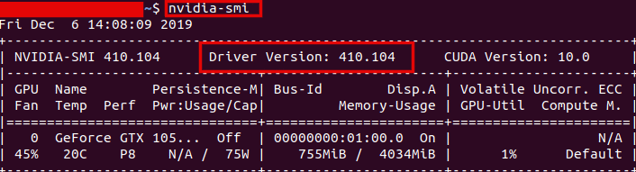


#### Installing Prerequisites

- If you don't have neither docker nor docker-compose use the following  command 

  ​			`chmod +x install_full.sh && source install_full.sh`

- If you have docker ce installed and wish only to install docker-compose and perform necessary operations,  use the following command 

  ​			`chmod +x install_compose.sh && source install_compose.sh`

- If both docker ce and docker-compose are installed then use the following command: 

  ​			`chmod +x install_minimal.sh && source install_minimal.sh`

- Install NVIDIA Drivers (410.x or higher) and NVIDIA Docker for GPU training by following the [official docs](https://github.com/nvidia/nvidia-docker/wiki/Installation-(version-2.0))


#### Validating the prerequisites installation

- Make sure that the `deleteme` files in  `datasets`   and 	`checkpoints`  folder are deleted. (deleteme files are placeholder files  used for git)

	 Make sure that the `base_dir` field in  `docker_sdk_api/api/paths.json` is correct (it must match the path of the root of the repo on your machine).	

  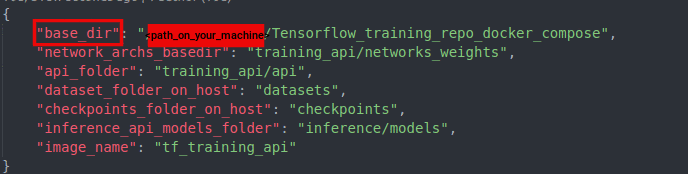


## Changes To Make

- Go to `gui/src/environments/environment.ts ` and `gui/src/environments/environment.prod.ts  ` and change the following:

      - field `url`:  must match the IP address of your machine
      - the IP field of the `inferenceAPIUrl`: must match the IP address of your machine (**Use the`ifconfig`command to check your IP address . Please use your private IP which starts by either 10. or 172.16.  or 192.168.**)


  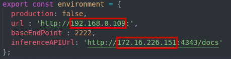

	 _environment.ts_


  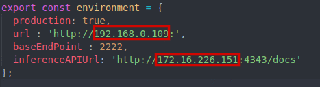

	 _environment.prod.ts_

- If you are behind a proxy, change the `args` `http_proxy` and `https_proxy`in `build.yml` to match the address of your proxy. (**you can find build.yml in the repo's root directory**)

  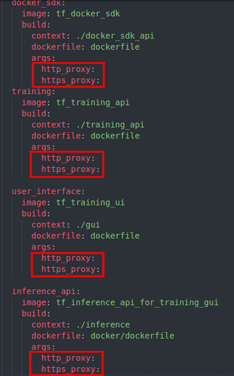


## Dataset Folder Structure

The following is an example of how a dataset should be structured. Please put all your datasets in the datasets folder.

```sh
├──datasets/
    ├──dummy_dataset/
        ├── images
        │   ├── img_1.jpg
        │   └── img_2.jpg
        ├── labels
        │   ├── json
        │   │   ├── img_1.json
        │   │   └── img_2.json
        │   └── pascal
        │       ├── img_1.xml
        │       └── img_2.xml
        └── objectclasses.json
```

**PS: you don't need to have both json and pascal folders. Either one is enough**


- If you want to label your images, you can use [LabelImg](https://github.com/tzutalin/labelImg) which is a free, open-source image annotation tool.
  This tool supports XML PASCAL label format

#### Objectclasses.json file example

  You must include in your dataset an objectclasses.json file with a similar structure to the example below:

  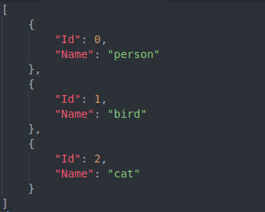


## Build the Solution

To build the solution, run the following command from the repository's root directory

```sh
docker-compose -f build.yml build
```

## Run the Solution

To run the solution, run the following command from the repository's root directory

```sh
docker-compose -f run.yml up
```


After a successful run you should see something like the following:

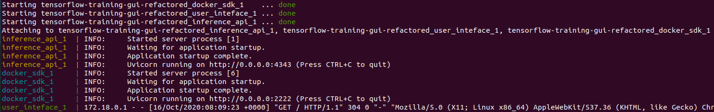


## Usage

- If the app is deployed on your machine:  open your web browser and type the following: `localhost:4200` or `127.0.0.1:4200  `


- If the app is deployed on a different machine: open your web browser and type the following: `<machine_ip>:4200`


#### 1- Preparing Dataset

Prepare your dataset for training

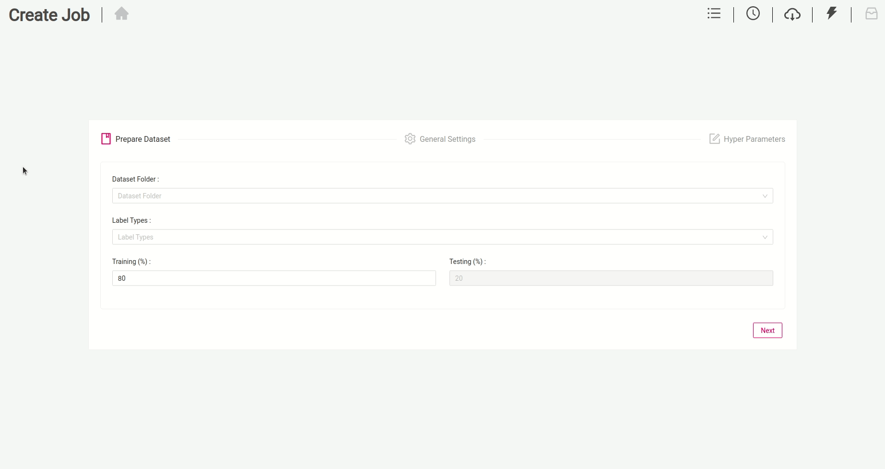

 


#### 2- Specifying General Settings

Specify the general parameters for you docker container

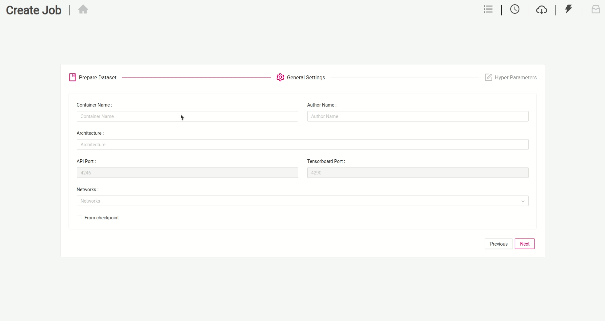


#### 3- Specifying Hyperparameters

Specify the hyperparameters for the training job

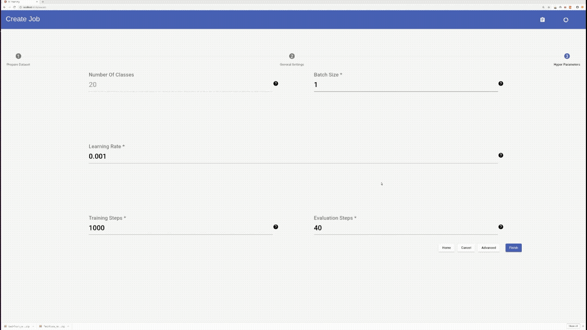


#### 4- Checking training logs

Check your training logs to get better insights on the progress of the training

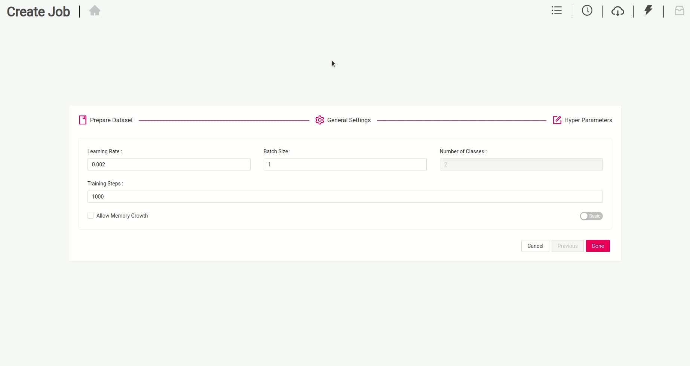


#### 5- Monitoring the training

Monitor the training using Tensorboard

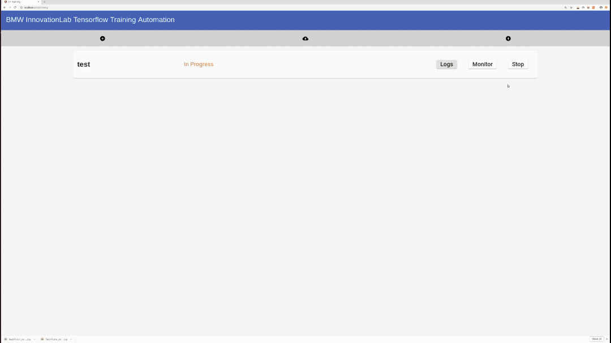


#### 6- Checking the status of the job

Check the status to know when the job is completed successfully

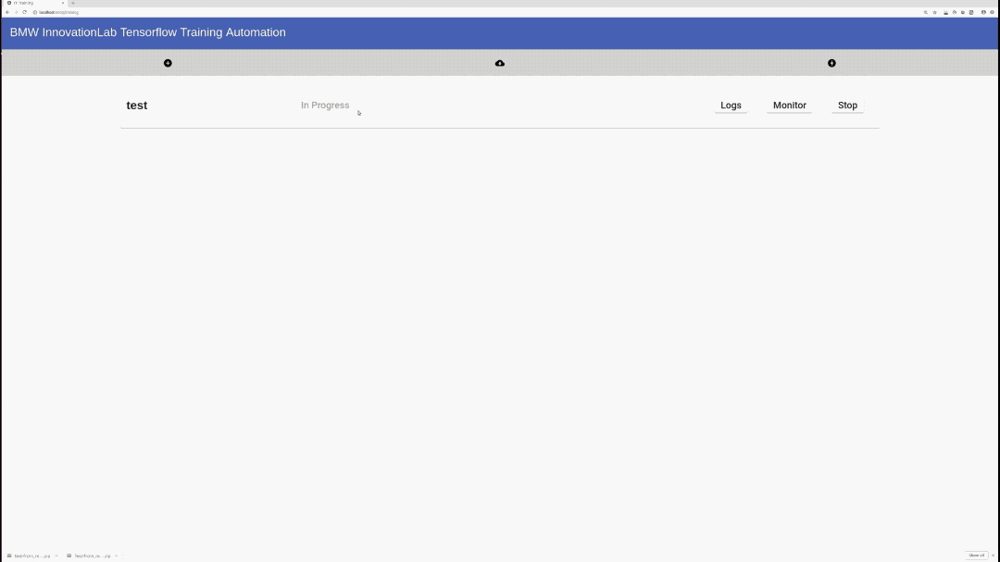


#### 7- Downloading and test with Swagger

Download your mode and easily test it with the built in inference API using Swagger

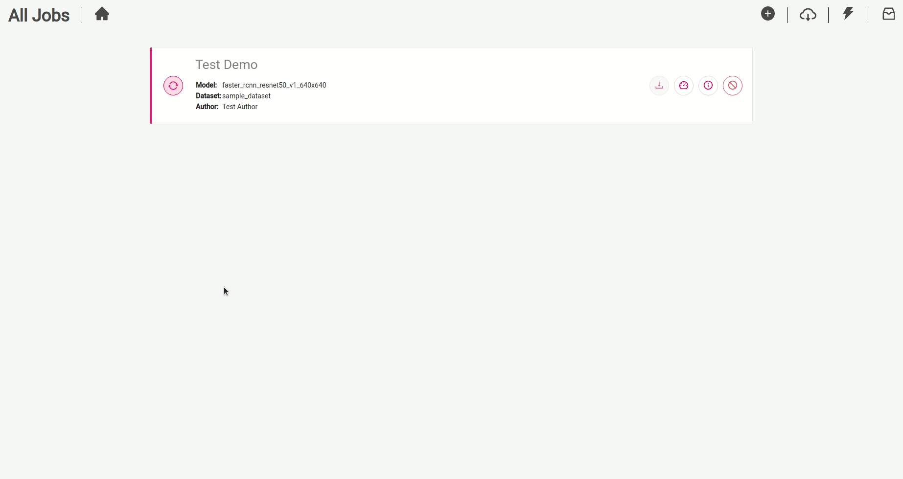


#### 8- Stopping and Delete the model's container

Delete the container's job to stop an ongoing job or to remove the container of a finished job. (Finished jobs are always available to download)

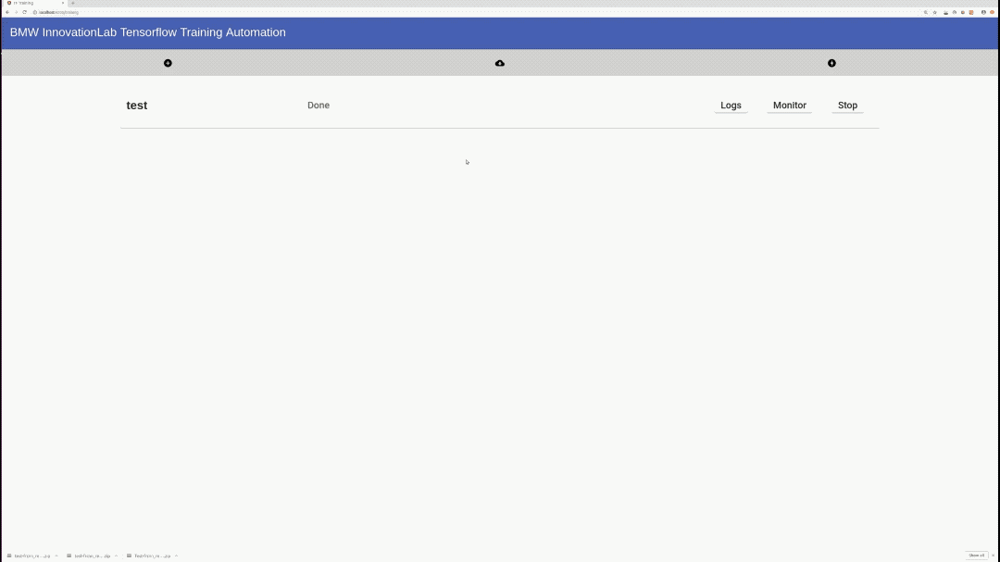


## Training and Tensorboard Tips

Check our [tips document](./training_api/docs/Tips.md) to have (1) (a better insight on training models based on our expertise) and (2) (a benchmark of the inference speed).

Our [tensorboard document](./training_api/docs/Tensorboard.md) helps you find your way more easily while navigating tensorboard


## Guidelines

- In advanced configuration mode, be careful while making the changes because it can cause errors while training. If that happens, stop the job and try again.

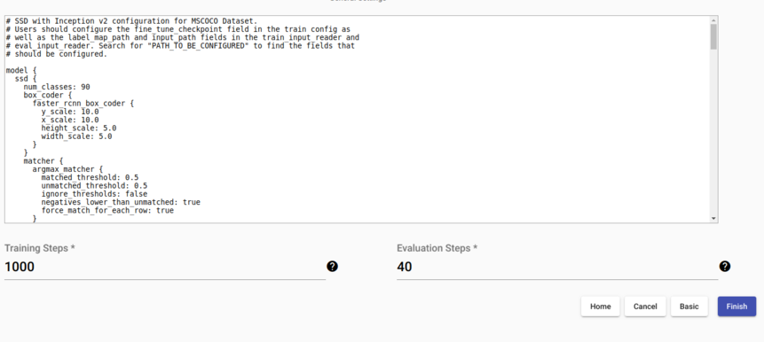


- In general settings, choose carefully the container name because choosing a name used by another container will cause errors.

  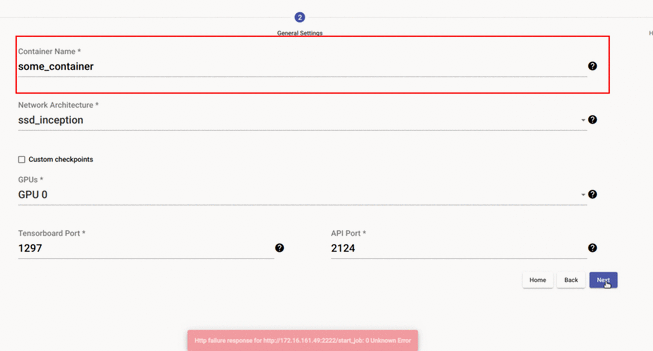

- When you leave tensorboard open for a long time, it might freeze. When encountered with such issue simply closing tensorboard tab in the browser and reopening it will solve the problem. 


## Acknowledgments

[inmind.ai](https://www.inmind.ai/)

[robotron.de](https://www.robotron.de/)


Joe Sleiman, inmind.ai, Beirut, Lebanon

Daniel Anani, inmind.ai, Beirut, Lebanon

Joe Abou Nakoul, inmind.ai, Beirut, Lebanon

Michael Ghosn, inmind.ai, Beirut, Lebanon

Elie Haddad, Beirut, Lebanon
