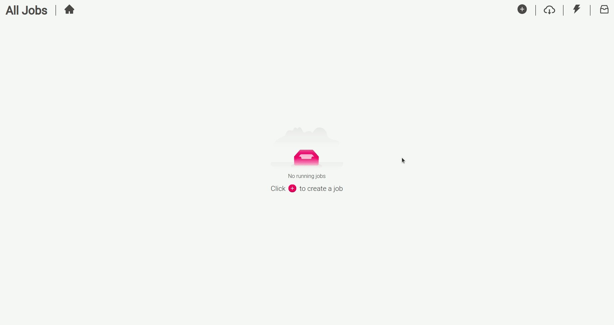
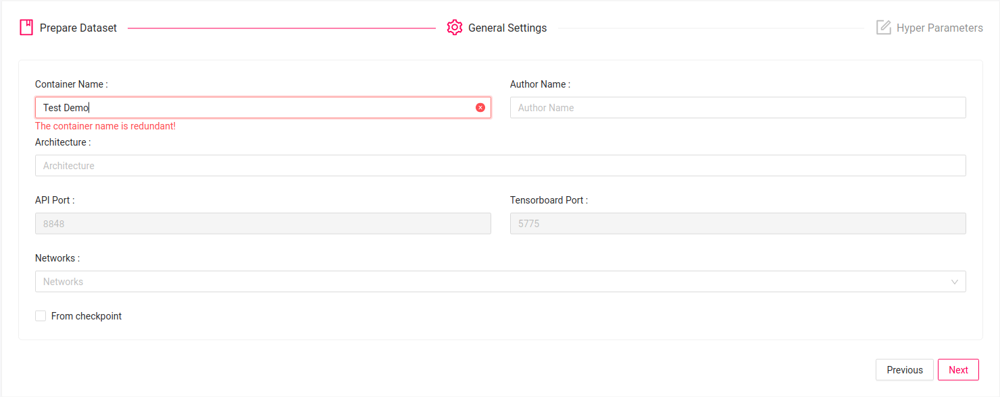
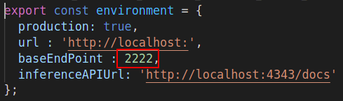

# Tensorflow 2 Object Detection Training GUI for Linux

Updated for CUDA 11 and Tensorflow 2!!!

This repository allows you to get started with training a State-of-the-art Deep Learning model with little to no configuration needed!  You provide your labeled dataset and you can start the training right away and monitor it with TensorBoard. 
You can even test your model with our built-in Inference REST API. Training with TensorFlow has never been so easy.

You can also use our [BMW-Labeltool-lite](https://github.com/BMW-InnovationLab/BMW-Labeltool-Lite.git) to label your dataset. The images and labels can be used directly for training. 

- This repository is based on [Tensorflow Object Detection API](https://github.com/tensorflow/models/tree/master/research/object_detection)
- The tensorflow version used is in this repo is **2.5.0**
- All supported networks in this project are taken from the [tensorflow model zoo](https://github.com/tensorflow/models/blob/master/research/object_detection/g3doc/tf2_detection_zoo.md)
- All training are made using pre-trained network weights.
- The pre-trained weights that you can use out of the box are based on the COCO dataset. 
- The app was tested with **Google Chrome** and it is recommended to use Chrome when training.
- This repository support training on both **CPU** and on multiple **GPU** (up to 2 GPUs)


​	


## Prerequisites 


- Ubuntu 18.04
- NVIDIA Drivers (418.x or higher)
- Docker CE latest stable release
- NVIDIA Docker 2 
- Docker-Compose


## Setting Up Project Requirements Automated

**This step is recommended to be able to run the solution correctly.**

The setup script will check and adjust all the requirements needed based on the user input.

- Run the following command 

  `chmod +x setup_solution_parameters.sh && source setup_solution_parameters.sh`

  - The script will check if docker and docker-compose are installed and if not, it will install them.

    

  - You will be prompted to choose **build architecture GPU/CPU** for the training solution. 

    

    - If you chose GPU the script will check if nvidia-docker is installed and if not, it will install it.


  - The script will prompt all the network interfaces that are available so you can select which interface you want to extract the ip address from it
  
    

  - You will be prompted to choose if you want to set up a proxy

    

  - You will be prompted to select all the pre-trained weights network that you want to be downloaded during the docker image build (use the up/down arrow to go up and down, space to select/unselect, enter to submit your selection and esc to quit)
  
    


## Setting Up Project Requirements Manually

#### How to check for prerequisites

**To check if you have docker-ce installed:** 

​		    	      `docker --version`

**To check if you have docker-compose installed:**

​     			     `docker-compose --version`

**To check if you have nvidia-docker installed:**

​     			     `dpkg -l | grep nvidia-docker`


**To check your nvidia drivers version, open your terminal and type the command `nvidia-smi`**


#### Installing Prerequisites

- If you don't have neither docker nor docker-compose use the following  command 

  ​			`chmod +x install_full.sh && source install_full.sh`

- If you have docker ce installed and wish only to install docker-compose and perform necessary operations,  use the following command 

  ​			`chmod +x install_compose.sh && source install_compose.sh`

- Install NVIDIA Drivers (418.x or higher) and NVIDIA Docker for GPU training by following the [official docs](https://github.com/nvidia/nvidia-docker/wiki/Installation-(version-2.0))
- Make sure that the `.gitkeep` files in  `datasets`, `checkpoints`, `tensorboards` and `inference_api/models` folder are deleted. (.gitkeep files are placeholder 
  files  used for git)
  
- Make sure that the `base_dir` field in  `docker_sdk_api/assets/paths.json` is correct (it must match the path of the root of the repo on your machine).	

  

- Make sure that the `image_name` field in  `docker_sdk_api/assets/paths.json` is correct (it must match your chosen architecture for the training 
  `tf2_training_api_cpu` or `tf2_training_api_gpu`).	

  


- Go to  `gui/src/environments/environment.ts ` and `gui/src/environments/environment.prod.ts  ` and change the following:

  - field `url`:  must match the IP address of your machine

  - the IP field of the `inferenceAPIUrl `: must match the IP address of your machine (**Use the `ifconfig `command to check your IP address . Please use your private IP which starts by either 10. or 172.16.  or 192.168.**)
  
  
    \
    _environment.ts_


    \
    _environment.prod.ts_

If you are behind a proxy:

  - Enter you proxy settings in the `<base-dir>/proxy.json ` file

    


  - Enter the following command:

    ```sh
      python3 set_proxy_args.py
    ```


## Dataset Folder Structure

The following is an example of how a dataset should be structured. Please put all your datasets in the datasets folder.

```sh
├──datasets/
    ├──sample_dataset/
        ├── images
        │   ├── img_1.jpg
        │   └── img_2.jpg
        ├── labels
        │   ├── json
        │   │   ├── img_1.json
        │   │   └── img_2.json
        │   └── pascal
        │       ├── img_1.xml
        │       └── img_2.xml
        └── objectclasses.json
```

**PS: you don't need to have both json and pascal folders. Either one is enough**

- If you want to label your images, you can use our [BMW-LabelTool-Lite](https://github.com/BMW-InnovationLab/BMW-Labeltool-Lite) which is a free, open-source image annotation tool.
  This tool supports our JSON label format

#### Objectclasses.json file example

  You must include in your dataset an objectclasses.json file with a similar structure to the example below:

  

## Midweight and Heavyweight Solution

**Midweight:** Downloading specific supported  online pre-trained weights during the docker image build.<br>
 To do that, open the json file `training_api/assets/networks.json` and change the values of the networks you wish to download to **true**. 


**Heavyweight (default):** Downloading all the supported  online pre-trained weights during the docker image build. <br>
 To do that, open the json file `training_api/assets/networks.json` and change the value of **"select_all"** to **true**.


**PS: if you don’t download the weights during the build,  you won’t be able to use the network during the training unless you rebuild the solution with the proper network chosen.**

All the training are made using the pre-trained network weight based on coco dataset.


## Build the Solution
If you wish want to deploy the training workflow in GPU mode, please write the following command from the repository's root directory

```sh
docker-compose -f build_gpu.yml build
```
If you wish want to deploy the training workflow in CPU mode, please write the following command from the repository's root directory

```sh
docker-compose -f build_cpu.yml build 
```


## Run the Solution

If you wish want to deploy the training workflow in GPU mode, please write the following command

```sh
docker-compose -f run_gpu.yml up
```
If you wish to deploy the training workflow in CPU mode, please write the following command

```sh
docker-compose -f run_cpu.yml up
```


After a successful run you should see something like the following:

## 


## Usage

- If the app is deployed on your machine:  open your web browser and type the following: `localhost:4200` or `127.0.0.1:4200`


- If the app is deployed on a different machine: open your web browser and type the following: `<machine_ip>:4200`


#### 1- Preparing Dataset

Prepare your dataset for training

 

## 

------


#### 2- Specifying General Settings

Specify the general parameters for you docker container


## 


------

#### 3- Specifying Hyperparameters

Specify the hyperparameters for the training job


## 


------
#### 4- Specifying Hyperparameters advanced 

Specify the advanced hyperparameters for the training job


## 

------

#### 5- Checking training logs

Check your training logs to get better insights on the progress of the training


## 

------

#### 6- Monitoring the training

Monitor the training using Tensorboard


------

#### 7- Checking the status of the job 

Check the status to know when the job is completed successfully


------

#### 8-  Downloading and test with Swagger


Download your mode and easily test it with the built-in inference API using Swagger


------
#### 9- Stopping and Delete the model's container


Delete the container's job to stop an ongoing job or to remove the container of a finished job. (Finished jobs are always available to download)


------
#### 10- Visualizing graphs and metrics of Deleted Jobs


Visualize graphs and metrics of Deleted Jobs with Tensorboard





------


## Training and Tensorboard Tips

Check our [tips document](./docs/Tips.md) to have (1) (a better insight on training models based on our expertise) and (2) (a benchmark of the inference speed).

Our [tensorboard document](./docs/Tensorboard.md) helps you find your way more easily while navigating tensorboard


## Guidelines

- In advanced configuration mode, be careful while making the changes because it can cause errors while training. If that happens, stop the job and try again.

  - the **paths** in `fine_tune_checkpoint` should be entered **manually** when you choose **train from checkpoint**

  - Scroll down to find **fine_tune_checkpoint** and replace **<name-of-the-checkpoint>**  with your **network-name** and  **checkpoint name**:

    - **fine_tune_checkpoint** :

      ```json
      fine_tune_checkpoint: "/checkpoints/<network-name>/<name-of-the-checkpoint>/ckpt-0"
      ```
      


- In general settings, choose carefully the container name because choosing a name used by another container will cause errors.

  

- When you try to monitor the job using tensorboard the page may not open, wait for some seconds and refresh the page.

- When you leave tensorboard open for a long time, it might freeze. When encountered with such issue simply closing tensorboard tab in the browser and reopening it will solve the problem. 

<br><br>

## Change Docker-sdk default port

To change the docker-sdk default port `2222` to any other port of your choice:

- change the uvicorn port inside `docker_sdk_api/docker/Dockerfile` to the port of your choice

  

- rebuild the docker-sdk image using the following commend in the root of the repo:

  - `docker-compose -f build.yml build docker_sdk`

- change the `baseEndPoint : <port-of-your-choice` inside `gui/src/environments/environment.ts ` and `gui/src/environments/environment.prod.ts` 

  

  

- rebuild the GUI image using the following comment in the root of the repo:

  - `docker-compose -f build.yml build user_interface`

- after this you can run the solution as following: `docker-compose -f run.yml up`

<br><br>

## Know Issues

You might face some errors in some cases during the training. Most common ones are:

- `The running container has no RepoTag please kill to proceed: Container ID: <id-container>` This issue is caused by some container not having a name, in that case you should rename that container or kill (make sure it is safe to remove this container) it via `docker kill <id-container>`.
- `Job Not Started: 404 Client Error Not Found("pull access denied for <image-name>, repository does not exists or may require 'docker login' ...)` this issue is cause when you are trying to run a training docker image that you don't have. The main reason of this is not properly building the training_api or not setting up project requirements please refer to **Setting Up Project Requirements** section in the documentation.
- `Dataset Not Valid` this error means that you dataset structure is not valid or the images/labels formate are not supported.
- Training job not started after general settings step: One of the main reason is that the paths are not adjusted in `docker_sdk_api/assets/paths.json` field `base_dir`. You can solve this issue by running `./setup_solution_parameters.sh` and choosing the training version you want to use `GPU/CPU`.

## Citing

If you use this repository in your research, consider citing it using the following Bibtex entry:

```
@misc{bmwevaluationtool,
  author = {BMW TechOffice MUNICH},
  title = {TensorFlow Training GUI},
  howpublished = {\url{https://github.com/BMW-InnovationLab/BMW-TensorFlow-Training-GUI}},
  year = {2022},
}
```

## Acknowledgments

- Hadi Koubeissy, [inmind.ai](https://inmind.ai/), Beirut, Lebanon

- Ismail Shehab, [inmind.ai](https://inmind.ai/), Beirut, Lebanon

- Joe Sleiman, [inmind.ai](https://inmind.ai/), Beirut, Lebanon

- Jimmy Tekli, BMW Innovation Lab, Munich, Germany

- [Chafic Abou Akar](https://github.com/chaficii), BMW TechOffice, Munich, Germany
