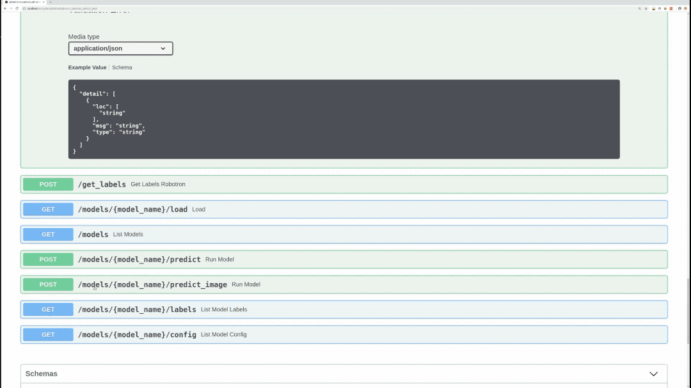
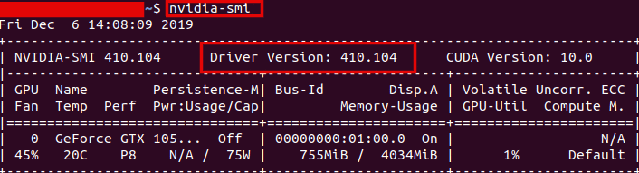
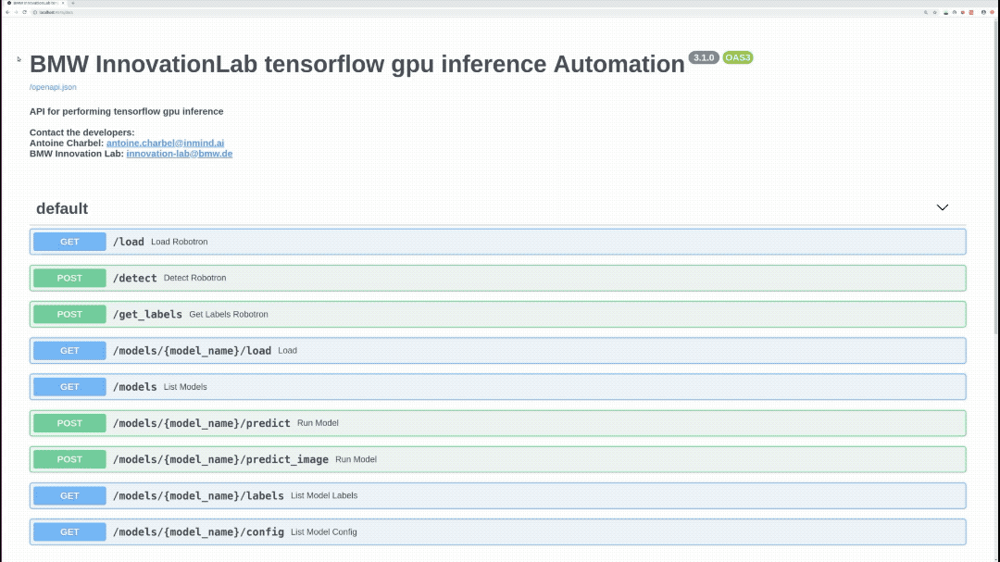
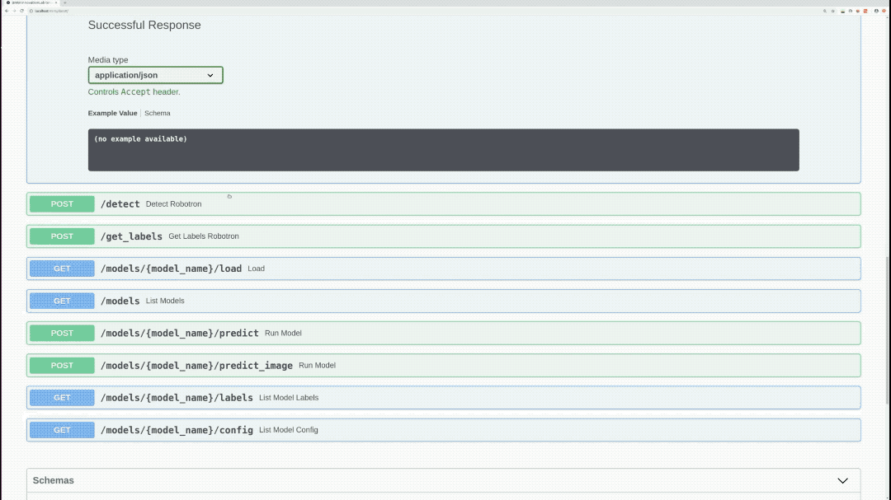
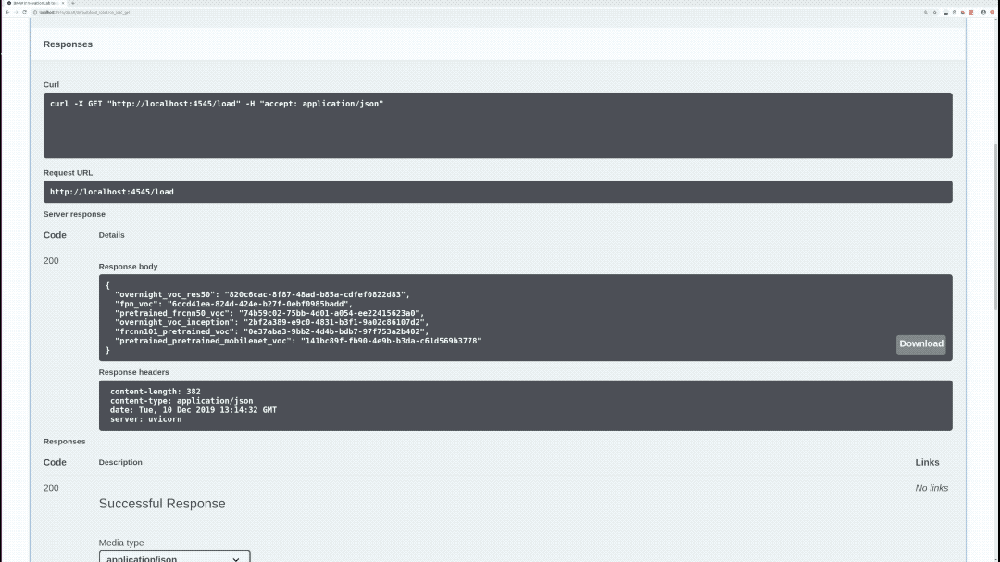

# Tensorflow GPU Inference API

This is a repository for an object detection inference API using the Tensorflow framework.

This repo is based on [Tensorflow Object Detection API](https://github.com/tensorflow/models/tree/master/research/object_detection).

The Tensorflow version used is 2.2.0. The inference REST API works on GPU. It's only supported on Linux Operating systems.

Models trained using our training tensorflow repository can be deployed in this API. Several object detection models can be loaded and used at the same time.

This repo can be deployed using either **docker** or **docker swarm**.

Please use **docker swarm** only if you need to:

* Provide redundancy in terms of API containers: In case a container went down, the incoming requests will be redirected to another running instance.

* Coordinate between the containers: Swarm will orchestrate between the APIs and choose one of them to listen to the incoming request.

* Scale up the Inference service in order to get a faster prediction especially if there's traffic on the service.

If none of the aforementioned requirements are needed, simply use **docker**.



## Prerequisites

- Ubuntu 18.04
- NVIDIA Drivers (410.x or higher)
- Docker CE latest stable release
- NVIDIA Docker 2

### Check for prerequisites

To check if you have docker-ce installed:

```sh
docker --version
```

To check if you have nvidia-docker installed:

```sh
nvidia-docker --version
```

**To check your nvidia drivers version, open your terminal and type the command `nvidia-smi`**



### Install prerequisites

Use the following command to install docker on Ubuntu:

```sh
chmod +x install_prerequisites.sh && source install_prerequisites.sh
```

Install NVIDIA Drivers (410.x or higher) and NVIDIA Docker for GPU by following the [official docs](https://github.com/nvidia/nvidia-docker/wiki/Installation-(version-2.0))

## Build The Docker Image

In order to build the project run the following command from the project's root directory:    


- For GPU Build:  

```sh
docker build -t tf2_inference_api_gpu -f docker/dockerfile-gpu .
```

- For CPU Build:

```
docker build -t tf2_inference_api_cpu -f docker/dockerfile .
```


### Behind a proxy


- For GPU Build:  

```sh
docker build --build-arg http_proxy='' --build-arg https_proxy='' -t tf2_inference_api_gpu -f docker/dockerfile-gpu .
```

- For CPU Build:

```
docker build --build-arg http_proxy='' --build-arg https_proxy='' -t tf2_inference_api_cpu -f docker/dockerfile .
```

## Run the docker container

As mentioned before, this container can be deployed using either  **docker** or **docker swarm**. 

If you wish to deploy this API using **docker**, please issue the following run command. 

If you wish to deploy this API using **docker swarm**, please refer to following link [docker swarm documentation](./README-docker_swarm.md). After deploying the API with docker swarm, please consider returning to this documentation for further information about the API endpoints as well as the model structure sections.

To run the API, go the to the API's directory and run the following:

#### Using Linux based docker:


- For GPU:

```sh
docker run --gpus '"device=<- gpu numbers seperated by commas ex:"0,1,2" ->"' -itv $(pwd)/models:/models -v $(pwd)/models_hash:/models_hash -p <port-of-your-choice>:4343 tf2_inference_api_gpu
```

- For CPU:

```sh
docker run -itv $(pwd)/models:/models -v $(pwd)/models_hash:/models_hash -p <port-of-your-choice>:4343 tf2_inference_api_cpu
```

- 


The <docker_host_port> can be any unique port of your choice.

The API file will be run automatically, and the service will listen to http requests on the chosen port.


## API Endpoints

To see all available endpoints, open your favorite browser and navigate to:

```
http://<machine_IP>:<docker_host_port>/docs
```
The 'predict_batch' endpoint is not shown on swagger. The list of files input is not yet supported.

**P.S: If you are using custom endpoints like /load, /detect, and /get_labels, you should always use the /load endpoint first and then use /detect or /get_labels**

### Endpoints summary

#### /load (GET)

Loads all available models and returns every model with it's hashed value. Loaded models are stored and aren't loaded again



#### /detect (POST)

Performs inference on specified model, image, and returns bounding-boxes



#### /get_labels (POST)

Returns all of the specified model labels with their hashed values



#### /models/{model_name}/predict_image (POST)

Performs inference on specified model, image, draws bounding boxes on the image, and returns the actual image as response


#### /models (GET)

Lists all available models

#### /models/{model_name}/load (GET)

Loads the specified model. Loaded models are stored and aren't loaded again

#### /models/{model_name}/predict (POST)

Performs inference on specified model, image, and returns bounding boxes.

#### /models/{model_name}/labels (GET)

Returns all of the specified model labels

#### /models/{model_name}/config (GET)

Returns the specified model's configuration

#### /models/{model_name}/predict_batch (POST)

Performs inference on specified model and a list of images, and returns bounding boxes

**P.S: Custom endpoints like /load, /detect, and /get_labels should be used in a chronological order. First you have to call /load, and then call /detect or /get_labels**

## Model structure

The folder "models" contains subfolders of all the models to be loaded.
Inside each subfolder there should be a:

- pb file (frozen_inference_graph.pb): contains the model weights

- pbtxt file (object-detection.pbtxt): contains model classes

- Config.json (This is a json file containing information about the model)

  ```json
    {
        "inference_engine_name": "tensorflow2_detection",//for tf2 models or "tensorflow_detection for tf1 models"
        "confidence": 60,
        "predictions": 15,
        "number_of_classes": 2,
        "framework": "tensorflow",
        "type": "detection",
        "network": "inception"
    }
  ```
  P.S:
  - You can change confidence and predictions values while running the API
  - The API will return bounding boxes with a confidence higher than the "confidence" value. A high "confidence" can show you only accurate predictions
    - The "predictions" value specifies the maximum number of bounding boxes in the API response

## Benchmarking

<table>
    <thead align="center">
        <tr>
            <th></th>
            <th>Windows</th>
            <th colspan=3>Ubuntu</th>
        </tr>
    </thead>
    <thead align="center">
        <tr>
            <th>Network\Hardware</th>
            <th>Intel Xeon CPU 2.3 GHz</th>
            <th>Intel Xeon CPU 2.3 GHz</th>
            <th>Intel Xeon CPU 3.60 GHz</th>
            <th>GeForce GTX 1080</th>
        </tr>
    </thead>
    <tbody align="center">
        <tr>
            <td>ssd_fpn</td>
            <td>0.867 seconds/image</td>
            <td>1.016 seconds/image</td>
            <td>0.434 seconds/image</td>
            <td>0.0658 seconds/image</td>
        </tr>
        <tr>
            <td>frcnn_resnet_50</td>
            <td>4.029 seconds/image</td>
            <td>4.219 seconds/image</td>
            <td>1.994 seconds/image</td>
            <td>0.148 seconds/image</td>
        </tr>
        <tr>
            <td>ssd_mobilenet</td>
            <td>0.055 seconds/image</td>
            <td>0.106 seconds/image</td>
            <td>0.051 seconds/image</td>
            <td>0.052 seconds/image</td>
        </tr>
        <tr>
            <td>frcnn_resnet_101</td>
            <td>4.469 seconds/image</td>
            <td>4.985 seconds/image</td>
            <td>2.254 seconds/image</td>
            <td>0.364 seconds/image</td>
        </tr>
        <tr>
            <td>ssd_resnet_50</td>
            <td>1.34 seconds/image</td>
            <td>1.462 seconds/image</td>
            <td>0.668 seconds/image</td>
            <td>0.091 seconds/image</td>
        </tr>
        <tr>
            <td>ssd_inception</td>
            <td>0.094 seconds/image</td>
            <td>0.15 seconds/image</td>
            <td>0.074 seconds/image</td>
            <td>0.0513 seconds/image</td>
        </tr>
    </tbody>
</table>

## Acknowledgment

[inmind.ai](https://inmind.ai)

[robotron.de](https://robotron.de)

Joe Sleiman, inmind.ai , Beirut, Lebanon

Antoine Charbel, inmind.ai, Beirut, Lebanon

Hadi koubeissy, inmind.ai,Beirut,Lebanon