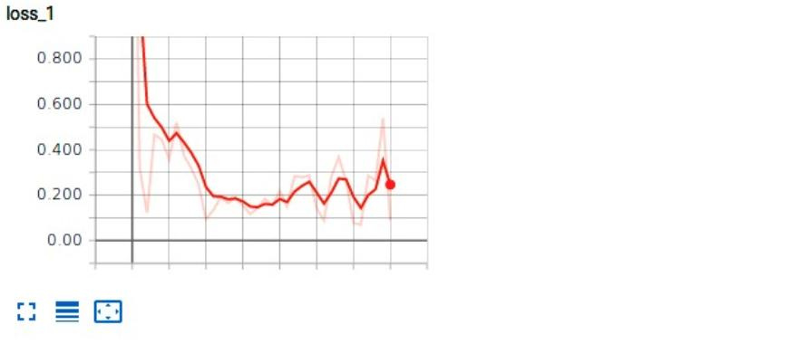
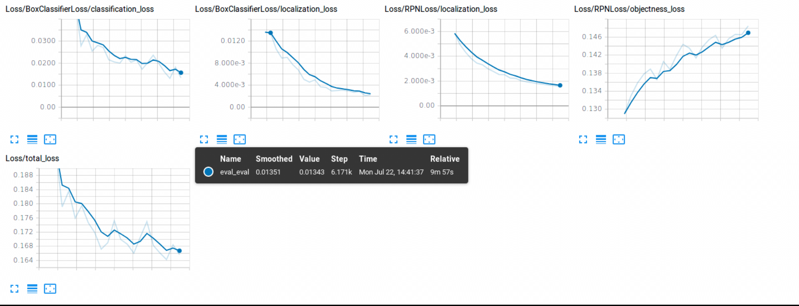
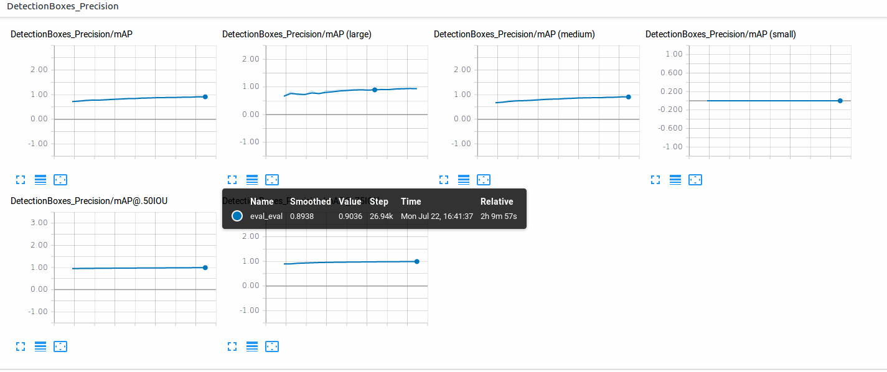

#  Tensorboard Graphs

_In this document, we will explore the most important graphs seen on tensorboard and how to judge if a model is good or not_

---

When monitoring our training using tensorboard we care mainly for three criterias:

- The training loss
- The evaluation loss
- The evaluation mAP

### Training Loss

This function labeled as loss_1 represents the loss according to your training data. 

It is decreasing function, which means that its value shoud be as small as possible. 

### Evaluation Loss

These functions labeled as loss  represent the loss according to your test data.

The total loss function summarizes everything. It is also a decreasing function.

**Caution: If your training loss has much lower values than your evaluation loss that means that your model is overfitting**

### Evaluation mAP

 

These functions labeled as DetectionBoxes_Precision represent the mean average precision or (mAP). It is a value between 0 and 1. The closer it is to 1, the better.

The graph DetectionBoxes_Precision/mAP, summarizes the mAP measure.

 